# FreakFightsFan

Freak fights are fights between popular people.
The FreakFightsFan application contains information and statistics about federations, events, fights and fighters of
freak fight federations.
I created this application because I am a fan of freak fights and I wanted to practice building fullstack application
with .NET technologies.

## Table of contents

* [Launch](#launch)
* [Presentation](#presentation)
* [Technologies](#technologies)
* [Architecture](#architecture)
* [Project types and references](#project-types-and-references)
* [Projects content](#projects-content)
* [Packages](#packages)
* [Features](#features)
* [Roles](#roles)
* [Project status](#project-status)

## Launch

Run application with one command (setup all docker containers, create database, apply migrations):

```
cd C:\Users\bartl\source\repos\FreakFightsFan
docker compose up --build -d
```

Created containers:

- C# Web API backend:

```
http://localhost:5000
```

- Blazor WASM frontend:

```
http://localhost:7000
```

- MSSQL database:

```
Host: localhost 
Port: 1433 
Database/Schema: FreakFightsFan
Username: sa
Password: Password1!
Server: freakfightsfan.database
```

- Seq Api logs:

```
http://localhost:8081
```

Login credentials:

```
SuperAdmin:
- Email: freakfightsfan@gmail.com
- Password: Asd123!
Admin:
- Email: freakfightsfan1@gmail.com
- Password: Asd123!
User:
- Email: freakfightsfan2@gmail.com
- Password: Asd123!
```

## Presentation

Federations view:
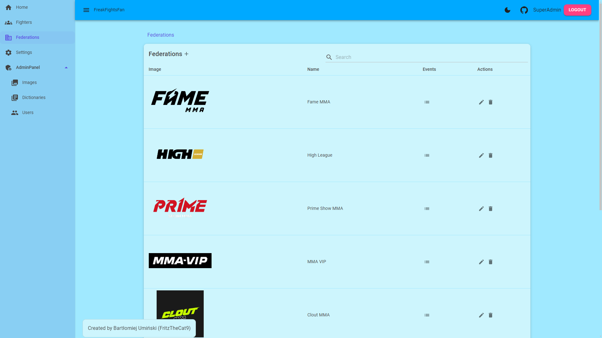

Events view:
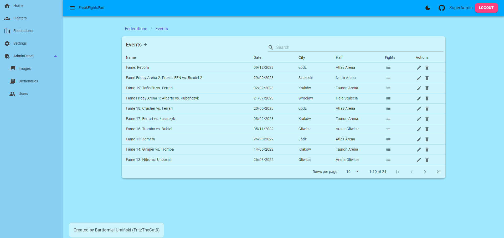

Fights view:
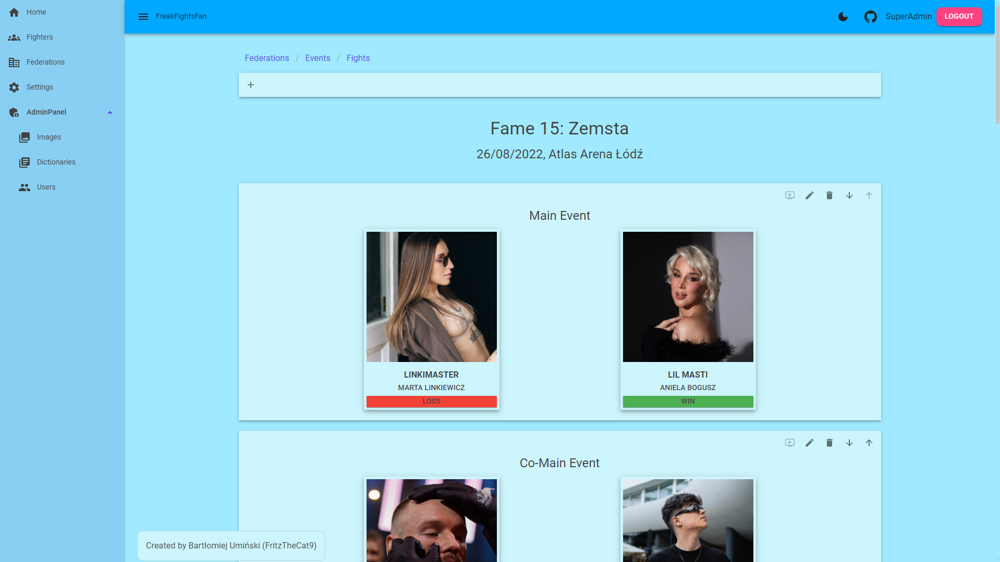

Create fight dialog:
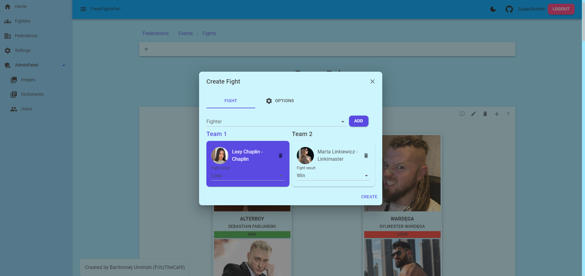

Fighters view:
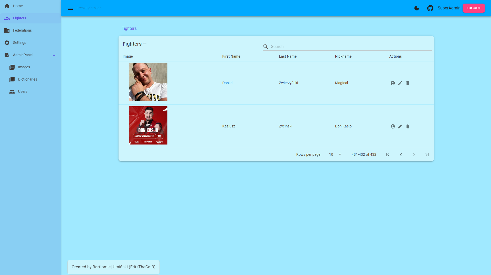

Fighter profile view:
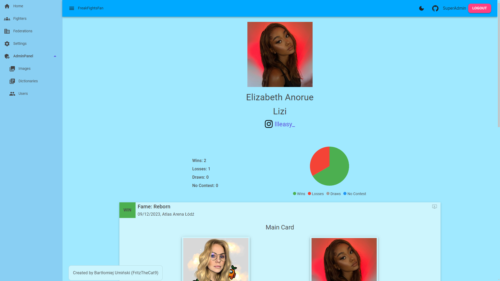

Users view:
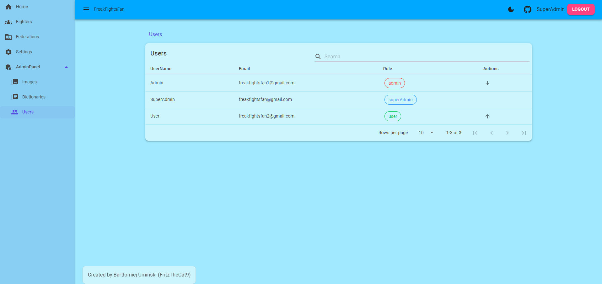

Dictionaries view:
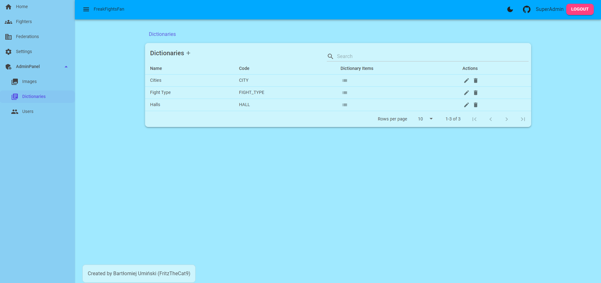

Dictionary items view:
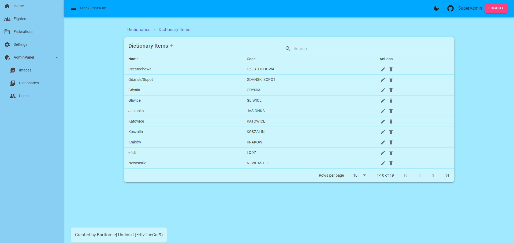

Images view:
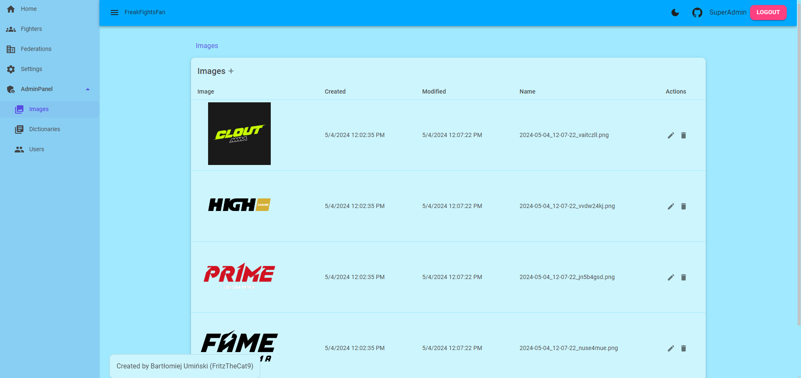

Settings view:
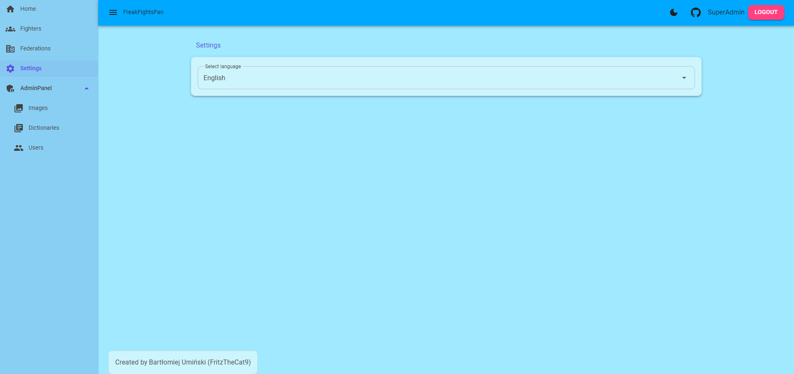

## Technologies

- C# 12
- .NET 8.0
- Blazor WebAssembly
- Angular 17.1.1

## Architecture

Blazor WebAssembly frontend with .NET Minimal API connecting to the MSSQL database. Monolithic architecture with
Vertical Slices. Code separated by feature.

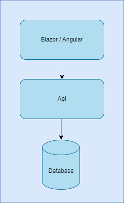

## Project types and references

- FreakFightsFan.Api - ASP .NET Core Web API (Backend)
- FreakFightsFan.Blazor - Blazor WebAssembly Standalone App (Frontend)
- FreakFightsFan.FeatureGenerator - Console App (Code generation for feature)
- FreakFightsFan.IntegrationTests - xUnit Test Project (Integration Tests)
- FreakFightsFan.Shared - Class Library (Backend and Frontend shared code)
- FreakFightsFan.UnitTests - xUnit Test Project (Unit Tests)
- freak-fights-fan - Angular Project (Frontend 2)

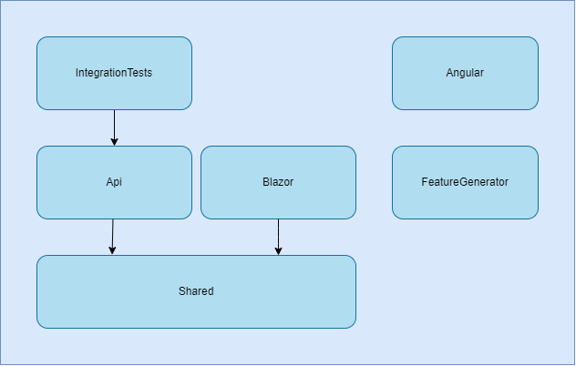

## Projects content

Technical features in projects.

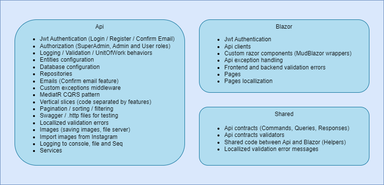

## Packages

Nuget packages and libraries used in projects.

- Api
    - [EntityFrameworkCore](https://www.nuget.org/packages/Microsoft.EntityFrameworkCore.SqlServer) - ORM for connecting
      to the database
    - [MediatR](https://www.nuget.org/packages/MediatR/) - CQRS, Vertical Slices (code separated by Features)
    - [FluentValidation](https://www.nuget.org/packages/FluentValidation) - Commands, Queries and server side logic
      validation
    - [FluentEmail](https://www.nuget.org/packages/FluentEmail.Razor) - Sending registration confirmation email and
      registration succeeded email
    - [Serilog](https://www.nuget.org/packages/Serilog/3.1.2-dev-02097) - Logging to console, file and Seq
    - [JwtBearer](https://www.nuget.org/packages/Microsoft.AspNetCore.Authentication.JwtBearer) - Jwt Token
      Authentication
    - [Swagger](https://www.nuget.org/packages/Swashbuckle.AspNetCore) - Manual Api testing
    - [Selenium](https://www.nuget.org/packages/OpenQA.Selenium.Chrome.ChromeDriverExtensions) - Fighter images import
      from Instagram (web scraping)
- Blazor
    - [MudBlazor](https://www.nuget.org/packages/MudBlazor) - Blazor UI library
    - [Blazored.FluentValidation](https://www.nuget.org/packages/Blazored.FluentValidation) - Frontend validation +
      Backend validation
    - [Blazored.LocalStorage](https://www.nuget.org/packages/Blazored.LocalStorage) - store Jwt Token and selected
      language in local storage
    - [Localization](https://www.nuget.org/packages/Microsoft.Extensions.Localization) - Validation errors and pages
      translations
- Integration Tests
    - [xunit](https://www.nuget.org/packages/xunit) - Testing library
    - [FluentAssertions](https://www.nuget.org/packages/FluentAssertions/7.0.0-alpha.3) - Assertions library
    - [Testcontainers](https://www.nuget.org/packages/Testcontainers) - Api integration tests with docker
- Angular
    - [Angular Material](https://material.angular.io/) - Angular UI library

## Features

- Dictionaries
    - Create dictionary
    - Delete dictionary
    - Update dictionary
    - Get all dictionaries (paginated, sorted and filtered)
    - Get selected dictionary
- Dictionary items
    - Create dictionary item
    - Delete dictionary item
    - Update dictionary item
    - Get all dictionary items by code (paginated, sorted and filtered)
    - Get all dictionary item (paginated, sorted and filtered)
    - Get selected dictionary item
- Events
    - Create federation event
    - Delete federation event
    - Update federation event
    - Get all federation events (paginated, sorted and filtered)
    - Get selected federation event
- Federations
    - Create federation
    - Delete federation
    - Update federation
    - Get all federations (paginated, sorted and filtered)
    - Get selected federation
- Fighters
    - Create fighter
    - Delete fighter
    - Update fighter
    - Get all fighters (paginated, sorted and filtered)
    - Get selected fighter
- Fights
    - Create event fight
    - Delete event fight
    - Move fight (upwards or downwards the fight card)
    - Update event fight
    - Get all event fights (paginated, ordered)
    - Get fighter profile (selected fighter fights and statistics)
    - Get selected fighter
- Images
    - Create image (save image file on server)
    - Delete image
    - Import federation images
    - Import fighters images from their Instagram profiles
    - Update image
    - Get all images (paginated and sorted)
    - Get selected image
- Teams
    - Get all teams (paginated)
    - Get selected team
- Users
    - Confirm user registration and send registration success email
    - Degrade selected user (Admin -> User)
    - Login user if email is confirmed
    - Promote selected user (User -> Admin)
    - Refresh Jwt Token
    - Register new user and send confirmation email
    <!-- - Update user image -->
    - Update user theme
    - Get all users (paginated, sorted and filtered)
    - Get selected user

## Roles

- SuperAdmin - ony one user have SuperUser role (can promote and degrade other users)
- Admin - can do CRUD operations across website, access to Admin Panel
- User - can view website data
- Anonymous - can view website data

## Project status

Web Api and Blazor frontend are working. I am currently adding more features and improvements.

Planned features and updates:

- Request CorrelationId visible on frontend page with error (user can give error correlationId to admin and ask for
  help)
- Blazor logging
- Fix bug with validation on create / update fight modal
- Api Health Checks
- Fight Types (MMA, BOXING, K1, ...)
- Fight Result (KO, TKO, ...)
- Fight description (special rules etc.)
- Fighter nationality (as dictionary item)
- GitHub actions
- App deployment
- Update user image feature
- Resend email confirmation email
- Send fight card email to users before incoming event
- Fix Feature Generator
- More integration tests
- Unit tests
- Working Angular frontend
